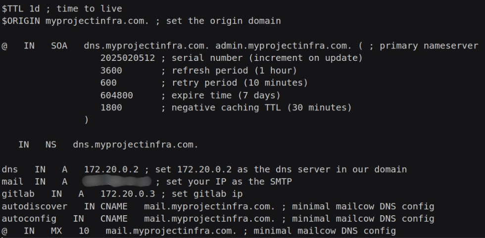
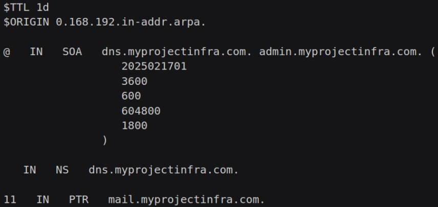

# Dockerized CI/CD Pipeline: GitLab, Mailcow, BIND & Runner Video Guide - Part 1

## Preparing your PC

#### Update and upgrade your repositories

#### Setting Up Docker and Docker Compose

1. [Docker Installation](https://docs.docker.com/engine/install/)
2. Add your user to docker group, using append (-aG)

#### Make the project directory as the normal user

1. Change directory
2. Start an online repository to avoid losing data
3. Make bind and GitLab folder

#### Create an external docker network

## DNS

#### Create the Docker Compose file

1. Create compose.yaml file inside your project's root directory
2. Create bind service
4. Set container name
5. Set container image
6. Set environment variables
    - BIND9_USER=root
    - TZ=America/Sao_Paulo
7. Port 53. If you are in newer Ubuntu versions, will may need to specify your IPv4, instead of just using “53:53”
8. Set the volumes:
    - ./bind/config:/etc/bind (your configuration files)
    - ./bind/cache:/var/cache/bind (helps speed up repeated queries)
    - ./bind/records:/var/lib/bind (stores zone files, DNS database files, and other related data)
    - ./bind/run:/run/named (stores PID files, control sockets, and runtime data)
9. Specify the custom subnet and IP

#### Create the bind/ folder

1. Create bind folder
2. Create config directory inside bind folder
3. Copy and edit the named.conf file to bind/config
[named.conf file](https://github.com/victor-raphael17/cicd-tutorial-part-1/blob/main/bind/config/named.conf)
4. Create the zone file [.zone file](https://github.com/victor-raphael17/cicd-tutorial-part-1/blob/main/bind/config/myprojectinfra.com.zone)

5. Create the reverse DNS zone file [reverse DNS zone file](https://github.com/victor-raphael17/cicd-tutorial-part-1/blob/main/bind/config/192.168.0.zone)

6. Run the compose so we can install the dockerized mailcow
    - Check if bind container is fine
7. Set the resolved.conf file to use your IP to resolve DNS
    - You should be able to ping your domain now

## Mailcow

#### Prepare your system

1. Check OS compatibility
    - [Mailcow Docs](https://docs.mailcow.email/getstarted/prerequisite-system/)
2. Allow 25, 80, 110, 143, 465, 587, 993, 995, 4190/tcp ports
3. Check if your NTP and system clock are synchronized

#### Clone Mailcow Dockerized repository

1. Go to /opt/ and clone the repository as root
    - [Mailcow repository](https://github.com/mailcow/mailcow-dockerized.git)
2. Generate config and run update

#### Access "mail.<your domain >/admin" in your browser

1. Default user is admin
2. Default password is moohoo
3. You need to access the /admin login page, otherwise you won't be able to login as the system administrator

#### Configuring Mailcow

1. Change admin password
2. Add your domain and restart SOGo container
3. Add GitLab, GitLab administrator and first dev mailboxes
4. Test if you can access SOGo by logging with your gitlab

## GitLab

#### Create gitlab directory inside your project’s root folder

#### Create resolv.conf file

1. Define the nameserver as the bind IP
2. Define search as “.”
3. Define options as “ndots:0”

#### Download and edit the gitlab.rb

1. Download or copy the gitlab.rb template
    - [gitlab.rb template](https://gitlab.com/gitlab-org/omnibus-gitlab/blob/master/files/gitlab-config-template/gitlab.rb.template)
    - Add the file to your gitlab folder
    - Edit the file (please leave only what is string in quotation marks)
        - Set “external_url” to “https://gitlab.yourdomain.com”
        - Set “smtp_enable” to “true”
        - Set “smtp_address” to “mail.yourdomain.com”
        - Set “smtp_port” to “587”
        - Set “smtp_user_name” to “gitlab@yourdomain.com”
        - Set “smtp_password” to “your_gitlab_mail_password”
        - Set “smtp_domain” to "yourdomain.com”
        - Set “smtp_authentication” to “login”
        - Set “smtp_enable_starttls_auto” to “true”
        - Set “smtp_tls” to “false”
        - Set “smtp_openssl_verify_mode” to “none”
        - Set “gitlab_email_from” to “gitlab@yourdomain.com”
        - Set “gitlab_email_display_name” to  "noreply"
        - Set “gitlab_email_reply_to” to “gitlab@yourdomain.com”
        - Set “trusted_proxies” to your IPv4 range and your containers IP range
        - Set “store_initial_root_password” to “true”
        - Set “registry_external_url” to “https://gitlab.yourdomain.com:5050”
        - Uncomment nginx registry section (registry_nginx)

#### Edit compose.yaml file that we created earlier

1. Add gitlab service
2. Set container name
3. Set container image
4. Set restart policy
5. Set hostname to “gitlab.yourdomain.com”
6. Set ports
- '8080:80' (you won’t able to use 80:80 because mailcow is already using it)
- '8443:443' (the same thing will happen here)
- '22:22'
- '5050:5050'
7. Set "dns" to bind container's IP
8. According to GitLab documentation, you must specify this volumes:

9. We’ll also need specify the path for our gitlab.rb file
./gitlab/gitlab.rb:/etc/gitlab/gitlab.rb
./gitlab/resolv.conf:/etc/resolv.conf
10. Set “shm_size” to “256m”
11. Set networks to the subnet that we created earlier

#### Export GITLAB_HOME variable

1. Create /srv/gitlab/ directory and change the permission
2. Export the variable
3. Run compose

####  If you can’t login with /srv/gitlab/config/initial_root_password, you will need to change it using gitlab-rails console

1. [Reset root password](https://docs.gitlab.com/security/reset_user_password/#reset-your-root-password)
2. Example

#### Now you should be able to access gitlab.yourdomain.com in your browser and login with “root” and the password you defined
